# face-auth-kit

_A plug-and-play React package for authentication using facial detection and recognition._

[](https://www.npmjs.com/package/face-auth-kit)
[](https://github.com/yourusername/face-auth-kit)

Powered by **AWS Rekognition Face Liveness** - resistant to spoofing via printed photos, deepfakes, high-resolution images, and 3D masks.

---

## Core Dependencies

This package depends on the following AWS and UI packages, which are bundled:

- [@aws-amplify/ui-react-liveness](https://www.npmjs.com/package/@aws-amplify/ui-react-liveness)
- [@aws-sdk/client-rekognition](https://www.npmjs.com/package/@aws-sdk/client-rekognition)
- [@aws-sdk/client-sts](https://www.npmjs.com/package/@aws-sdk/client-sts)

---

## Installation

```bash
npm install face-auth-kit --legacy-peer-deps
```

> `--legacy-peer-deps` is required due to a known peer dependency conflict inside `@aws-amplify/ui-react-liveness`. It does not affect functionality.

---

## How It Works

```
FaceRegister / FaceLogin
        │
        ▼
Your /api/face-liveness-session     → CreateFaceLivenessSession + STS AssumeRole
        │                              (returns sessionId + short-lived credentials)
        ▼
AWS Amplify FaceLivenessDetectorCore
        │                              (handles camera, oval, liveness challenge, WebSocket)
        ▼
Your /api/face-liveness-result      → GetFaceLivenessSessionResults
        │                              Register: IndexFaces → returns faceId
        │                              Login:    SearchFacesByImage → returns faceId + similarity
        ▼
onSuccess({ faceId, similarity, livenessConfidence, ... })
```

All AWS SDK complexity is hidden inside the package. You only deal with `onSuccess` and `onError` callbacks.

---

## AWS Setup

Before using this package, you need to set up two things in your AWS account(and if you do not have one, [create one](https://signin.aws.amazon.com/signup?request_type=register)): an **IAM user** for your server and an **IAM role** for the liveness WebSocket session.

---

### Part 1 — Create the IAM User (`face-auth-kit`)

1. Sign in to the [AWS IAM Console](https://console.aws.amazon.com/iam/).
2. In the left navigation pane, choose **Users**, then click **Create user**.
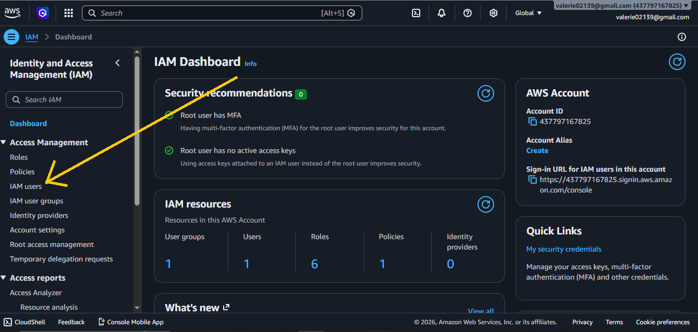
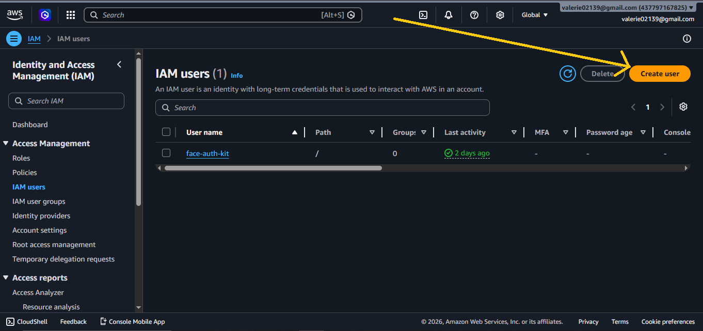
3. Enter the username **`face-auth-kit`** and click **Next**.
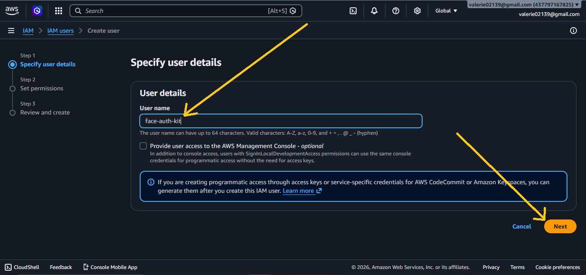
4. Select **Attach policies directly**, then click **Create policy**.
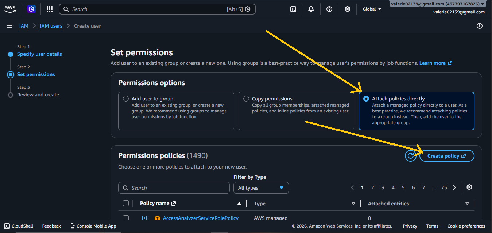
5. In the policy editor, choose the **JSON** tab and paste the following:

```json
{
    "Version": "2012-10-17",
    "Statement": [
        {
            "Effect": "Allow",
            "Action": [
                "rekognition:CreateCollection",
                "rekognition:IndexFaces",
                "rekognition:SearchFacesByImage",
                "rekognition:DeleteFaces",
                "rekognition:DetectFaces",
                "rekognition:CreateFaceLivenessSession",
                "rekognition:GetFaceLivenessSessionResults"
            ],
            "Resource": "*"
        },
        {
            "Effect": "Allow",
            "Action": "sts:AssumeRole",
            "Resource": "arn:aws:iam::YOUR_ACCOUNT_ID:role/face-liveness-role"
        }
    ]
}
```
> Replace `YOUR_ACCOUNT_ID` with your 12-digit AWS account ID (found in the top-right of your AWS Console).
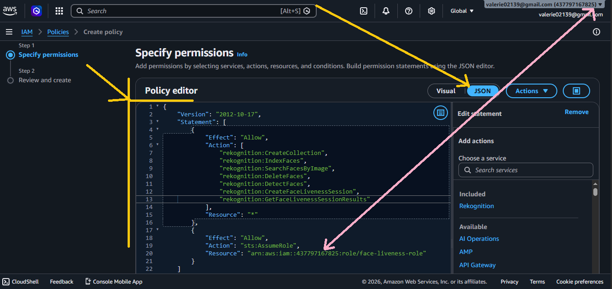
- click **Next** at the bottom right.
6. Name the policy **`face-auth-kit-policy`** and click **Create policy**.
7. Back on the user creation screen, search for and attach **`face-auth-kit-policy`**(and incase it didn't show up after search, reload the page and repeat step **3**, select **Attach policies directly** and search again), then click **Next** and **Create user**.
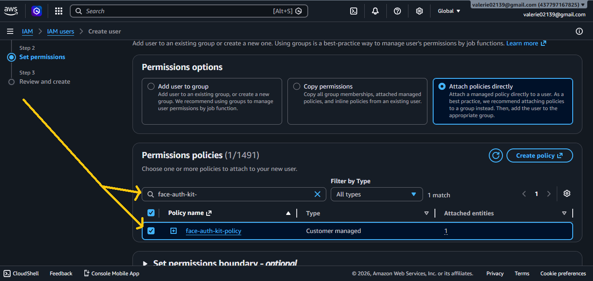
8. Click on the newly-created user. 
- Go to the **Security credentials** tab. 
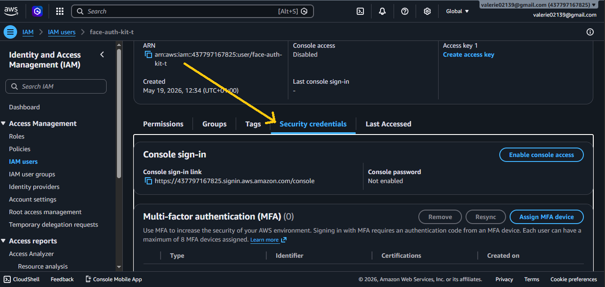
- Scroll to **Access keys**, and click **Create access key**.
9. Select **Application running outside AWS**, click **Next**, then **Create access key**.
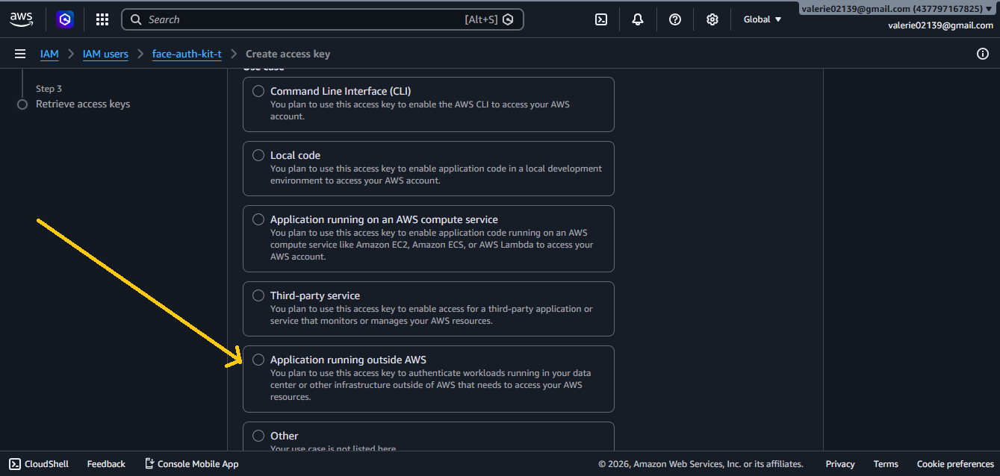
10. **Copy and save** both the `Access key ID` and `Secret access key`(or click the **Download .csv file** button). Click **Done** — you will not be able to see them again.

---

### Part 2 — Create the IAM Role (`face-liveness-role`)

This role is assumed temporarily by your server to give the browser just enough permission to start the liveness WebSocket session — nothing more.

1. In the [AWS IAM Console](https://console.aws.amazon.com/iam/), choose **Roles** in the left pane, then click **Create role**.
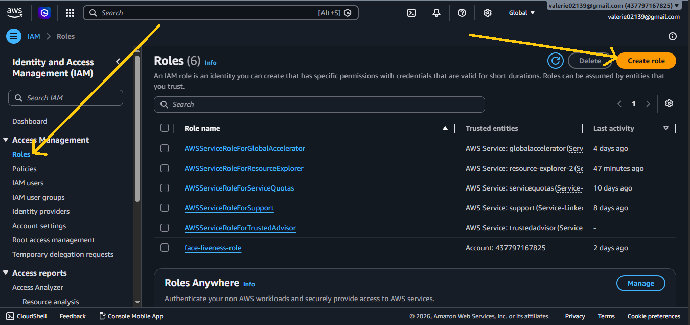
2. Under **Trusted entity type**, select **Custom trust policy**.
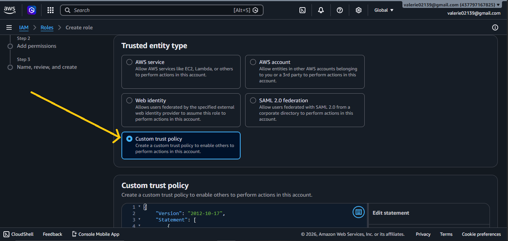
3. Paste the following trust policy, replacing `YOUR_ACCOUNT_ID` with your account ID:

```json
{
    "Version": "2012-10-17",
    "Statement": [
        {
            "Effect": "Allow",
            "Principal": {
                "AWS": "arn:aws:iam::YOUR_ACCOUNT_ID:user/face-auth-kit"
            },
            "Action": "sts:AssumeRole"
        }
    ]
}
```
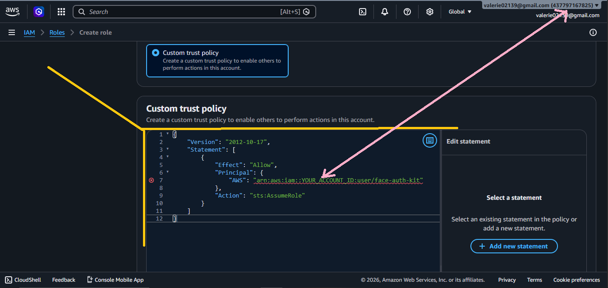
- Click **Next**.
4. While on the **Add permissions** page, [create a role policy](https://us-east-1.console.aws.amazon.com/iam/home?region=us-east-1#/policies) (this will open a new tab).
- Click **Create policy**.
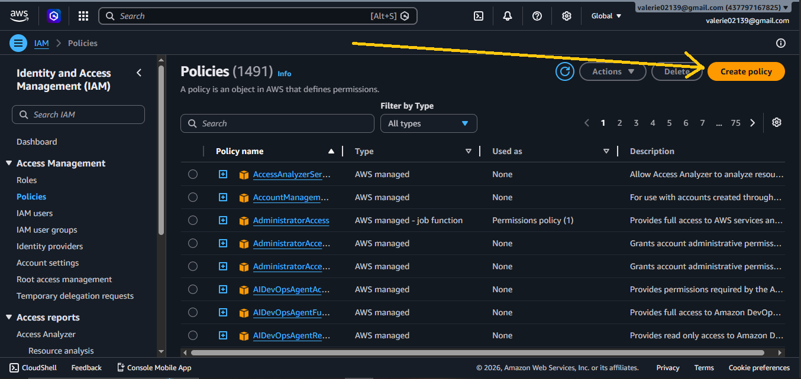
5. Choose the **JSON** tab and paste:

```json
{
    "Version": "2012-10-17",
    "Statement": [
        {
            "Effect": "Allow",
            "Action": "rekognition:StartFaceLivenessSession",
            "Resource": "*"
        }
    ]
}
```
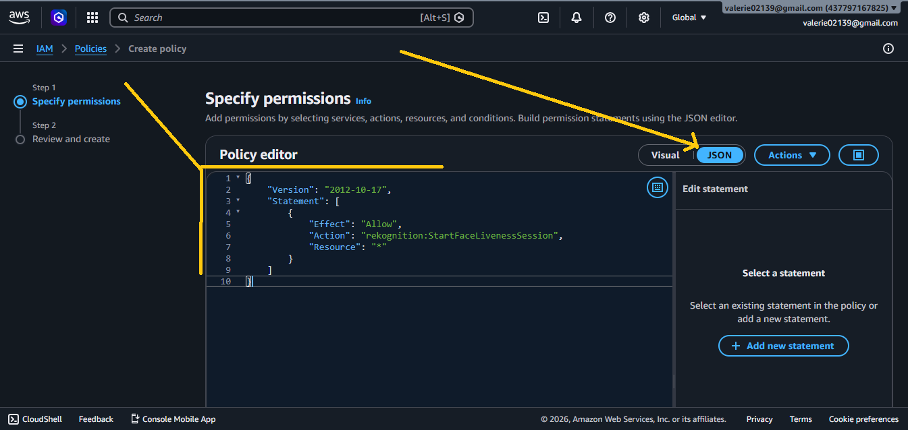
- Click **Next** at the bottom right.
6. Name this policy **`face-liveness-role-policy`** and click **Create policy**.
7. Back on the role creation tab(the tab we left), refresh the policy list, search for **`face-liveness-role-policy`**, select it, and click **Next**.
8. Name the role **`face-liveness-role`** and click **Create role**.
9. Click on the newly-created role and copy its **ARN** — it looks like `arn:aws:iam::YOUR_ACCOUNT_ID:role/face-liveness-role`.
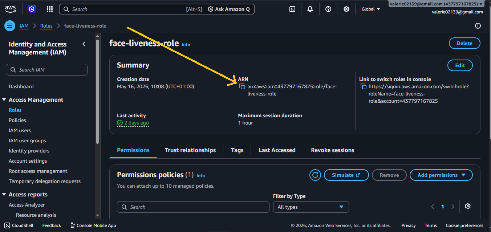
---

### Part 3 — Environment Variables

Include in your `.env.local` file:

```dotenv
AWS_ACCESS_KEY_ID="your_access_key_id"
AWS_SECRET_ACCESS_KEY="your_secret_access_key"
AWS_REGION=us-east-1
AWS_LIVENESS_ROLE_ARN="arn:aws:iam::YOUR_ACCOUNT_ID:role/face-liveness-role"
```


---

## Usage

### 1. Create the API Routes

You need two API routes in your Next.js app. These are **your** routes — you create them and call the handlers from `face-auth-kit` inside them. The package handles all the AWS logic; you just wire up the route.

**`app/api/face-liveness-session/route.js`**
```js
import { faceLivenessSessionHandler } from 'face-auth-kit'

export async function POST(req) {
  return faceLivenessSessionHandler(req)
}
```

**`app/api/face-liveness-result/route.js`**
```js
import { faceLivenessResultHandler } from 'face-auth-kit'

export async function POST(req) {
  return faceLivenessResultHandler(req)
}
```

---

### 2. Register a Face

```jsx
import { FaceRegister } from 'face-auth-kit'

export default function RegisterPage() {
  return (
    <FaceRegister
      collectionId="my-app-users"
      onSuccess={({ faceId, livenessConfidence, confidence, faceDetails }) => {
        // Save faceId to your database against the user
        console.log('Store this faceId:', faceId)
      }}
      onError={({ code, message }) => {
        console.error(code, message)
      }}
      sessionApiEndpoint="/api/face-liveness-session"  // optional — this is the default
      resultApiEndpoint="/api/face-liveness-result"    // optional — this is the default
      theme="dark"
    />
  )
}
```

**`onSuccess` payload:**
```json
{
  "livenessConfidence": 77.30628967285156,
  "faceId": "e534ec94-ab1e-430b-8cee-c72c7934f203",
  "confidence": 99.99966430664062,
  "faceDetails": {
    "ageRange": { "Low": 22, "High": 28 },
    "quality": {
      "Brightness": 94.83789825439453,
      "Sharpness": 92.22801208496094
    }
  }
}
```

> Store `faceId` in your database linked to the user. This is what you'll look up on login.

---

### 3. Login with Face

```jsx
import { FaceLogin } from 'face-auth-kit'

export default function LoginPage() {
  return (
    <FaceLogin
      collectionId="my-app-users"
      onSuccess={({ faceId, similarity, livenessConfidence, confidence }) => {
        // You decide the threshold — the library returns the raw score
        if (similarity >= 90) {
          grantAccess(faceId) // look up faceId in your DB to identify the user
        } else {
          alert('Face not close enough match')
        }
      }}
      onError={({ code, message }) => {
        console.error(code, message)
      }}
      sessionApiEndpoint="/api/face-liveness-session"  // optional
      resultApiEndpoint="/api/face-liveness-result"    // optional
      theme="dark"
    />
  )
}
```

**`onSuccess` payload:**
```json
{
  "livenessConfidence": 79.06428527832031,
  "faceId": "76f3fce9-ceef-4e1c-aa6b-61e0102fd0c0",
  "similarity": 99.9786148071289,
  "confidence": 99.9999008178711
}
```

> `similarity` is a score from 0–100. You choose your own threshold — 90 is a reasonable default for most applications.
> `livenessConfidence` tells you how confident AWS is that the person is physically present (not a photo, deepfake, or mask).

---

## Props

### `<FaceRegister />`

| Prop | Type | Required | Default | Description |
|---|---|---|---|---|
| `collectionId` | `string` | ✅ | — | Your AWS Rekognition collection ID. Created automatically on first use. |
| `onSuccess` | `function` | ✅ | — | Called with `{ faceId, livenessConfidence, confidence, faceDetails }` |
| `onError` | `function` | ✅ | — | Called with `{ code, message }` |
| `sessionApiEndpoint` | `string` | ❌ | `/api/face-liveness-session` | The API route that creates the liveness session. **You must create this route in your app** — see Usage step 1. The prop is optional only if your route path matches the default. |
| `resultApiEndpoint` | `string` | ❌ | `/api/face-liveness-result` | The API route that fetches liveness results. **You must create this route in your app** — see Usage step 1. The prop is optional only if your route path matches the default. |
| `theme` | `"dark" \| "light"` | ❌ | `"dark"` | Component colour theme |
| `className` | `string` | ❌ | `""` | CSS class for the wrapper div |

### `<FaceLogin />`

| Prop | Type | Required | Default | Description |
|---|---|---|---|---|
| `collectionId` | `string` | ✅ | — | Must match the `collectionId` used during registration |
| `onSuccess` | `function` | ✅ | — | Called with `{ faceId, similarity, livenessConfidence, confidence }` |
| `onError` | `function` | ✅ | — | Called with `{ code, message }` |
| `sessionApiEndpoint` | `string` | ❌ | `/api/face-liveness-session` | The API route that creates the liveness session. **You must create this route in your app** — see Usage step 1. The prop is optional only if your route path matches the default. |
| `resultApiEndpoint` | `string` | ❌ | `/api/face-liveness-result` | The API route that fetches liveness results. **You must create this route in your app** — see Usage step 1. The prop is optional only if your route path matches the default. |
| `theme` | `"dark" \| "light"` | ❌ | `"dark"` | Component colour theme |
| `className` | `string` | ❌ | `""` | CSS class for the wrapper div |

---

## Error Codes

Both `onError` callbacks receive an object with a `code` and a human-readable `message`.

| Code | Meaning |
|---|---|
| `SESSION_CREATE_ERROR` | Could not start a liveness session — check your AWS credentials and network |
| `LIVENESS_FAILED` | The liveness challenge was not completed successfully |
| `SESSION_EXPIRED` | The session timed out (sessions are single-use and expire after 3 minutes) |
| `NO_FACE_DETECTED` | No face was found in the captured image |
| `NO_REFERENCE_IMAGE` | AWS could not extract a reference image from the liveness session |
| `NO_MATCH` | No matching face found in the collection *(login only)* |
| `MISSING_ROLE_ARN` | `AWS_LIVENESS_ROLE_ARN` is not set in your environment variables |
| `AWS_ERROR` | An unexpected AWS error occurred |

---

## Important Notes

**Duplicate registration:** AWS Rekognition does not detect duplicate face registrations on `IndexFaces`. If the same person registers twice, two separate `faceId` values will be stored and you will be charged for both. If you want to prevent this, run a login check before registering — if a match is found above your threshold, reject the registration.

**AWS billing:** You are charged per image processed by Rekognition and per face stored in a collection. Stored faces cost approximately $0.00001 per face per month. See [AWS Rekognition pricing](https://aws.amazon.com/rekognition/pricing/) for full details.

**Liveness sessions are single-use:** Each session ID can only be used once. If a user fails or the component unmounts, a new session is started automatically.

**AWS region:** `us-east-1` is the default region. AWS Face Liveness is not available in all regions — check [AWS regional services](https://aws.amazon.com/about-aws/global-infrastructure/regional-product-services/) if you need a different region.

**Security:** Your AWS credentials are never exposed to the browser. The `AWS_ACCESS_KEY_ID` and `AWS_SECRET_ACCESS_KEY` live only in your server environment. The browser only receives short-lived temporary credentials scoped to a single liveness session operation.

---

## License

MIT
